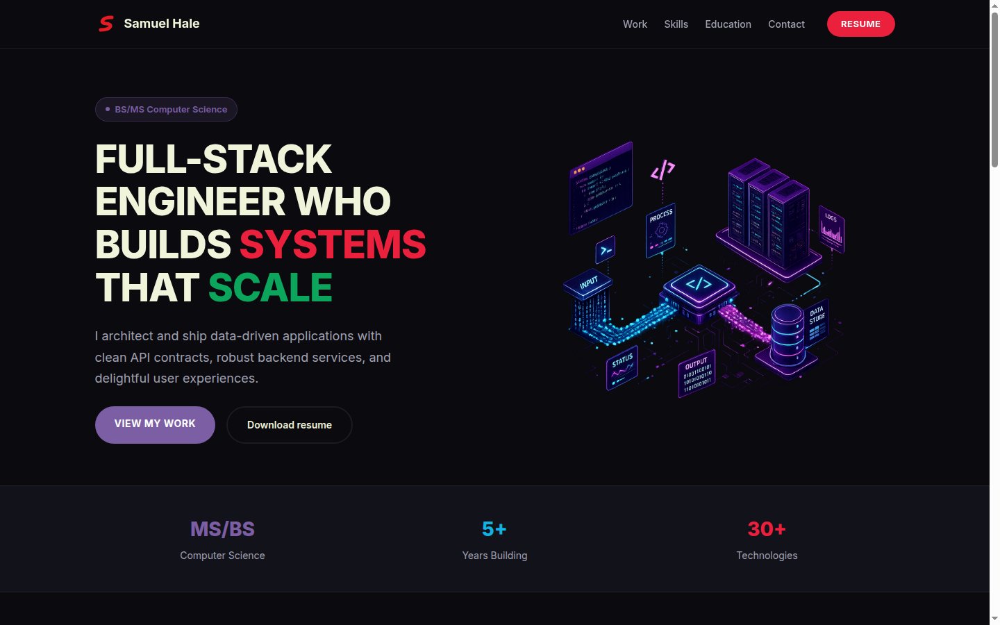

# Samuel Hale — Portfolio



Personal portfolio site built with vanilla HTML, CSS, and JavaScript. Hosted on GitHub Pages.

## Sections

- **Hero** — intro with badge, title, and call-to-action buttons
- **Stats** — quick highlights (degrees, years, technologies)
- **Relevant Experience** — project cards for full-stack, backend, and data engineering roles
- **Technical Skills** — categorized skill tags with visual sidebar
- **Education** — BS/MS Computer Science from East Carolina University
- **Contact** — email, LinkedIn, GitHub, phone

## Local dev

```bash
python3 -m http.server 8000
```

Open `http://localhost:8000` in a browser. No build step required.
